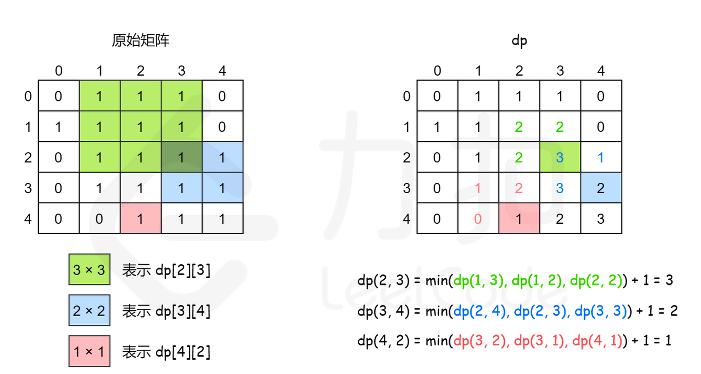

## 1010. 总持续时间可被 60 整除的歌曲

    在歌曲列表中，第 i 首歌曲的持续时间为 time[i] 秒。
    返回其总持续时间（以秒为单位）可被 60 整除的歌曲对的数量。形式上，我们希望索引的数字 i 和 j 满足  i < j 且有
    (time[i] + time[j]) % 60 == 0。
    示例1:
    	输入：[30,20,150,100,40]
    	输出：3
    	解释：这三对的总持续时间可被 60 整数：
    	(time[0] = 30, time[2] = 150): 总持续时间 180
    	(time[1] = 20, time[3] = 100): 总持续时间 120
    	(time[1] = 20, time[4] = 40): 总持续时间 60
    示例2:
    	输入：[60,60,60]
    	输出：3
    	解释：所有三对的总持续时间都是 120，可以被 60 整数。
    提示:
    	1. 1 <= time.length <= 60000
    	2. 1 <= time[i] <= 500

> 解法一：
> 最暴力的手段来解决，用两层循环来遍历所有的情况，这种方式是最简单的，但是时间复杂度是 O(n2)

```java
public static int  solution(int[]time){
		int count = 0;
		for(int i=0;i<time.length;i++){
			for(int j=i+1;j<time.length;j++){
				int sum = time[i] + time[j];
				if(sum%60==0){
					count++;
				}
			}
		}
		return count;
	}
```

> 解法二:
> 就是利用 hash 一次余数的个数记下来，提高命中率

```java
public static int solution2(int[] time){
		int count = 0;
		Map<Integer,Integer> map = new HashMap<Integer,Integer>();
		for(int i=0;i<time.length;i++){
			int remainder = time[i]%60;
			//查看余数是否在map里，如果有，说明两个数相加可以被60整除
			if(map.containsKey(remainder)){
				count += map.get(remainder);
			}

			//对于余数为零的单独添加map中
			if(remainder==0){
				map.put(0, map.getOrDefault(0, 0)+1);
			}else{
				int target = 60 -remainder;
				//记录配对余数
				map.put(target, map.getOrDefault(target, 0)+1);
			}
		}
		return count;

	}
```

> 解法三：
> 就是用空间换时间，先声明一个 60 的数组，分别记录余数的个数

```java
public static int solution3(int[] time){
		int count = 0;
		int[] arr = new int[60];//存放余数的次数

		for(int i=0;i<time.length;i++){
			int remainder = time[i] % 60;
			count += arr[remainder];

			int target = remainder == 0 ? 0 :60-remainder;
			arr[target]++;
		}
		return count;
	}
```

> 这个题有许多变形，例如两个数的和等于多少;两个数的乘积等于多少，都可以用这种方式来计算

## 136. 只出现一次的数字

    给定一个非空整数数组，除了某个元素只出现一次以外，其余每个元素均出现两次。找出那个只出现了一次的元素。
    说明：
    	你的算法应该具有线性时间复杂度。 你可以不使用额外空间来实现吗？
    示例1：
    	输入: [2,2,1]
    	输出: 1
    示例2:
    	输入: [4,1,2,1,2]
    	输出: 4

> 解法一：
> 借助 map 数字为 key，相同的累计加一，最后在遍历 map 为 1 的就是该要的结果，这种不符合要求
> 解法二：
> 异或的公式异或运算满足交换律和结合律，即 a⊕b⊕a=b⊕a⊕a=b⊕(a⊕a)=b⊕0=b

```java
public static int solution2(int[] nums){
		int result = 0;
		for(int i=0;i<nums.length;i++){
			result ^= nums[i];
		}
		return result;
	}
```

> 改题变形，例如缺失数字,找不同的数字

## 2. 两数相加

    给出两个 非空 的链表用来表示两个非负的整数。其中，它们各自的位数是按照 逆序 的方式存储的，并且它们的每个节
    点只能存储 一位 数字。
    如果，我们将这两个数相加起来，则会返回一个新的链表来表示它们的和。
    您可以假设除了数字 0 之外，这两个数都不会以 0 开头。
    示例一:
    	输入：(2 -> 4 -> 3) + (5 -> 6 -> 4)
    	输出：7 -> 0 -> 8
    	原因：342 + 465 = 807

> 这个题目主要考察链表相关的问题，要知道链表的声明和赋值遍历等，就是要注意有进位就可以;

```java
public class ListNode{
	int val;
	ListNode next;
	ListNode(int x){
		val = x;
	}
}
public class AddTwoNumbers{
	public static void main(String[] args) {
		ListNode l1 = new ListNode(4);
		ListNode l1_2 = new ListNode(5);
		ListNode l1_3 = new ListNode(6);
		l1.next = l1_2;
		l1_2.next = l1_3;

		ListNode l2 = new ListNode(5);
		ListNode l2_2 = new ListNode(4);
		ListNode l2_3 = new ListNode(7);
		l2.next = l2_2;
		l2_2.next = l2_3;
		ListNode result = solution(l1,l2);
		while(result!=null){
			System.out.println(result.val);
			result = result.next;
		}
	}

	public static ListNode solution(ListNode l1,ListNode l2){
		ListNode result = new ListNode(0);
		ListNode p = l1;
		ListNode q = l2;
		ListNode current = result;
		int carry = 0;

		while(p!=null || q!=null){
			int x = p==null? 0 : p.val;
			int y = q==null?0 : q.val;
			System.out.println(x + "=" + y);
			int sum = carry + x + y;
			carry = sum / 10;
			current.next = new ListNode(sum%10);
			current = current.next;
			if(p!=null){
				p = p.next;
			}
			if(q!=null){
				q = q.next;
			}
		}
		if(carry>0){
			current.next = new ListNode(carry);
		}
		return result.next;
	}
}
```

> 扩展题，加减乘除

## 3. 无重复字符的最长子串

    给定一个字符串，请你找出其中不含有重复字符的 最长子串 的长度。
    示例一:
    	输入: "abcabcbb"
    	输出: 3
    	解释: 因为无重复字符的最长子串是 "abc"，所以其长度为 3。
    示例二:
    	输入: "bbbbb"
    	输出: 1
    	解释: 因为无重复字符的最长子串是 "b"，所以其长度为 1。
    示例三:
    	输入: "pwwkew"
    	输出: 3
    	解释: 因为无重复字符的最长子串是 "wke"，所以其长度为 3。
    	请注意，你的答案必须是 子串 的长度，"pwke" 是一个子序列，不是子串。

> 这个题目主要考虑的是双指针滑动窗口的问题，左指针一个一个滑动，右指针一直往右滑动，如果不符合条件，删除左指针
> set 集合的元素，右指针继续右移

```java
public static int solution(String s){
		//存放字符串
		LinkedHashSet<Character> set = new LinkedHashSet<Character>();
		//子串的长度
		int result = 0;
		//右指针的位置
		int rk = 0;
		int len = s.length();
		for(int i=0;i<len;i++){
			if(i!=0){
				set.remove(s.charAt(i-1));
			}
			while(rk<len&&!set.contains(s.charAt(rk))){
				set.add(s.charAt(rk));
				++rk;
			}
			result = Math.max(result, set.size());
		}
		return result;
	}
```

## 560. 和为 K 的子数组 !!!

    给定一个整数数组和一个整数 k，你需要找到该数组中和为 k 的连续的子数组的个数。
    示例1：
    	输入:nums = [1,1,1], k = 2
    	输出: 2 , [1,1] 与 [1,1] 为两种不同的情况。
    说明:
    	1.数组的长度为 [1, 20,000]。
    	2.数组中元素的范围是 [-1000, 1000] ，且整数 k 的范围是 [-1e7, 1e7]。

> 暴力法  
> 前缀和 + 哈希表优化

```java
public static int solution2(int[] nums,int k){
		int result=0;
		int pre = 0;

		Map<Integer,Integer> map = new HashMap<Integer,Integer>();
		map.put(0, 1);

		for(int i=0;i<nums.length;i++){
			pre += nums[i];

			if(map.containsKey(pre - k)){
				result += map.get(pre-k);
			}

			map.put(pre, map.getOrDefault(pre, 0)+1);
		}
		return result;
	}
```

## 5. 最长回文子串 !!!

    给定一个字符串 s，找到 s 中最长的回文子串。你可以假设 s 的最大长度为 1000。
    示例 1：
    	输入: "babad"
    	输出: "bab"
    	注意: "aba" 也是一个有效答案。
    示例 2：
    	输入: "cbbd"
    	输出: "bb"

```java
public static String solution(String s){
		if(s==null | s.length()<2){
			return s;
		}

		int strLen = s.length();
		int maxStart = 0;
		int maxEnd = 0;
		int maxLen = 1;//最长回文串的长度

		boolean [][] dp = new boolean[strLen][strLen];
		for(int r=1;r<strLen;r++){
			for(int l=0;l<r;l++){
				if(s.charAt(l)==s.charAt(r) && (r-l<=2 || dp[l+1][r-1])){
					dp[l][r] = true;
					if(r-l+1>maxLen){
						maxLen = r-l+1;
						maxStart = l;
						maxEnd = r;
					}
				}
			}
		}
		return s.substring(maxStart,maxEnd+1);
	}
```

> 动态规划

## 6. Z 字形变换

    将一个给定字符串根据给定的行数，以从上往下、从左到右进行 Z 字形排列。
    比如输入字符串为 "LEETCODEISHIRING" 行数为 3 时，排列如下：
    L   C   I   R
    E T O E S I I G
    E   D   H   N
    之后，你的输出需要从左往右逐行读取，产生出一个新的字符串，比如："LCIRETOESIIGEDHN"。
    示例2：
    	输入: s = "LEETCODEISHIRING", numRows = 4
    	输出: "LDREOEIIECIHNTSG"
    	解释:
    		L     D     R
    		E   O E   I I
    		E C   I H   N
    		T     S     G

```java
public static String solution(String s,int numRows){
		if(numRows==1){return s;}

		List<StringBuilder> rows = new ArrayList<StringBuilder>();

		for(int i=0;i<Math.min(numRows,s.length());i++){
			rows.add(new StringBuilder());
		}

		int curRow = 0;
		boolean goDown = false;

		for(char c :s.toCharArray()){
			rows.get(curRow).append(c);
			if(curRow==0 || curRow == numRows-1){
				goDown = !goDown;
			}
			curRow += goDown?1:-1;
		}

		StringBuilder sb = new StringBuilder();
		for(StringBuilder row:rows){
			sb.append(row);
		}
		return sb.toString();
	}
```

## 1011. 在 D 天内送达包裹的能力

    传送带上的包裹必须在 D 天内从一个港口运送到另一个港口。
    传送带上的第 i 个包裹的重量为 weights[i]。每一天，我们都会按给出重量的顺序往传送带上装载包裹。我们装载的
    重量不会超过船的最大运载重量。
    返回能在 D 天内将传送带上的所有包裹送达的船的最低运载能力。
    示例1：
    	输入：weights = [1,2,3,4,5,6,7,8,9,10], D = 5
    	输出：15
    	解释：
    	船舶最低载重 15 就能够在 5 天内送达所有包裹，如下所示：
    	第 1 天：1, 2, 3, 4, 5
    	第 2 天：6, 7
    	第 3 天：8
    	第 4 天：9
    	第 5 天：10
    	请注意，货物必须按照给定的顺序装运，因此使用载重能力为 14 的船舶并将包装分成 (2, 3, 4, 5),
    	(1, 6, 7), (8), (9), (10) 是不允许的。
    示例2:
    	输入：weights = [3,2,2,4,1,4], D = 3
    	输出：6
    	解释：
    		船舶最低载重 6 就能够在 3 天内送达所有包裹，如下所示：
    		第 1 天：3, 2
    		第 2 天：2, 4
    		第 3 天：1, 4
    示例3：
    	输入：weights = [1,2,3,1,1], D = 4
    	输出：3
    	解释：
    	第 1 天：1
    	第 2 天：2
    	第 3 天：3
    	第 4 天：1, 1

```java
public static int solution(int[] weights,int D){
		int start = 0 ;
		int end = 0;

		for(int weight:weights){
			start = Math.max(start,weight);
			end += weight;
		}

		while(start<end){
			int mid = start + (end - start)/2;
			int currDay = 1;
			int currWeight = 0;
			for(int weight:weights){
				currWeight += weight;
				if(currWeight>mid){
					currWeight = weight;
					currDay += 1;
				}
			}
			if(currDay>D){
				start = mid + 1;
			}else{
				end = mid;
			}
		}
		return end;
	}
```

> 二分法

## 25. K 个一组翻转链表

    给你一个链表，每 k 个节点一组进行翻转，请你返回翻转后的链表。
    k 是一个正整数，它的值小于或等于链表的长度。
    如果节点总数不是 k 的整数倍，那么请将最后剩余的节点保持原有顺序。
    示例1:
    	给你这个链表：1->2->3->4->5
    	当 k = 2 时，应当返回: 2->1->4->3->5
    	当 k = 3 时，应当返回: 3->2->1->4->5
    说明:
    	你的算法只能使用常数的额外空间。
    	你不能只是单纯的改变节点内部的值，而是需要实际进行节点交换。

## 43. 字符串相乘

    给定两个以字符串形式表示的非负整数 num1 和 num2，返回 num1 和 num2 的乘积，它们的乘积也表示为字符串形式。
    示例1：
    	输入: num1 = "2", num2 = "3"
    	输出: "6"
    示例2:
    	输入: num1 = "123", num2 = "456"
    	输出: "56088"
    说明:
    	1.num1 和 num2 的长度小于110。
    	2.num1 和 num2 只包含数字 0-9。
    	3.num1 和 num2 均不以零开头，除非是数字 0 本身。
    	4.不能使用任何标准库的大数类型（比如 BigInteger）或直接将输入转换为整数来处理。

```java
public static boolean solution(int[] A){
		int sum = 0;
		for(int a:A){
			sum += a;
		}
		if(sum%3!=0){
			return false;
		}
		int len = A.length;
		int avg = sum/3;
		System.out.println(avg);
		int curr = 0;
		int i = 0;
		while(i<len){
			curr += A[i];
			i++;
			if(curr == avg){
				break;
			}
		}
		if(curr!=avg){
			return false;
		}
		int j = i ;
		curr = 0;
		while(j<len){
			curr += A[j];
			j++;
			if(curr==avg){
				break;
			}
		}
		System.out.println(i+"="+j + "=" + len);
		if(curr==avg && (j != len)){
			return true;
		}
		return false;
	}
```

## 1014. 最佳观光组合

    给定正整数数组 A，A[i] 表示第 i 个观光景点的评分，并且两个景点 i 和 j 之间的距离为 j - i。
    一对景点（i < j）组成的观光组合的得分为（A[i] + A[j] + i - j）：景点的评分之和减去它们两者之间的距离。
    返回一对观光景点能取得的最高分。
    示例:
    	输入：[8,1,5,2,6]
    	输出：11
    	解释：i = 0, j = 2, A[i] + A[j] + i - j = 8 + 5 + 0 - 2 = 11

```java
public static int solution(int[] A){
		int len = A.length;

		int pre_max = A[0] + 0;
		int result = 0;

		for(int j=1;j<len;j++){
			result = Math.max(result, pre_max + A[j]-j);
			pre_max = Math.max(pre_max, A[j]+j);
		}
		return result;
	}
```

> 公式：max= A[i]+i+A[j]-j;如果 A[j]-j 确定，我们可以找 j 前面的 A[i] + i 的最大值

## 统计全为 1 的正方形子矩阵

    给你一个 m * n 的矩阵，矩阵中的元素不是 0 就是 1，请你统计并返回其中完全由 1 组成的 正方形 子矩阵的个数。
    示例1:
    	输入：matrix =
    	[
    	  [0,1,1,1],
    	  [1,1,1,1],
    	  [0,1,1,1]
    	]
    	输出：15
    	解释：
    	边长为 1 的正方形有 10 个。
    	边长为 2 的正方形有 4 个。
    	边长为 3 的正方形有 1 个。
    	正方形的总数 = 10 + 4 + 1 = 15.
    示例2：
    	输入：matrix =
    	[
    	  [1,0,1],
    	  [1,1,0],
    	  [1,1,0]
    	]
    	输出：7
    	解释：
    	边长为 1 的正方形有 6 个。
    	边长为 2 的正方形有 1 个。
    	正方形的总数 = 6 + 1 = 7.

```java
public static int solution(int[][] matrix){
		if(matrix.length==0 || matrix[0].length==0){
			return 0;
		}
		int row = matrix.length;
		int col = matrix[0].length;

		int result = 0;
		int[][] dp = new int[row][col];

		for(int i=0;i<row;i++){
			for(int j=0;j<col;j++){
				if(matrix[i][j]==1){
					if(i==0 || j ==0){
						dp[i][j] = 1;
					}else{
						dp[i][j] = Math.min(Math.min(dp[i][j-1], dp[i-1][j-1]), dp[i-1][j]) + 1;
					}
				}
			result += dp[i][j];
			}
		}
		return result;
	}
```


